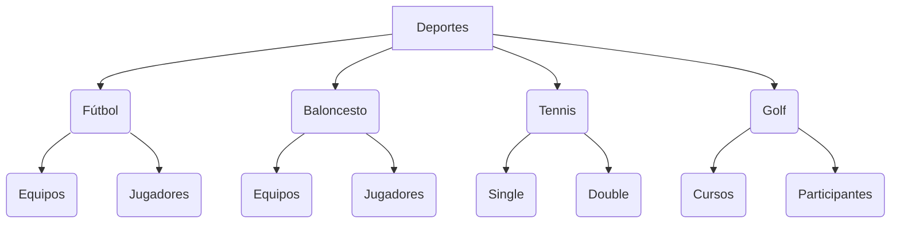

# Este es mi primer README
# -Sintaxis Básica

Para crear un título, agregas de uno a seis #asteríscos antes del texto del título. La cantidad de # que utilices determinará el nivel jerárquico y el tamaño del tipo de letra del encabezado.
# Primer nivel de encabezado
## Segundo nivel de encabezado
### Tercer nivel de encabezado

Cuando usas dos o más encabezados, GitHub genera automáticamente una tabla de contenido a la que puedes acceder haciendo clic dentro del encabezado del archivo. Cada título de encabezado aparece en la tabla de contenido y puede hacer clic en un título para navegar a la sección seleccionada.
## Estilo de texto

Puede indicar énfasis con texto en negrita, cursiva, tachado, subíndice o superíndice en campos y .mdarchivos de comentarios.

**Este es un ejemplo de texto en negrita** 

Para poner el contenido en negrita, éste se encierra entre ** ** o __ __ sin espacios a ambos lados

* *Este es un ejemplo de texto en cursiva* *
  
Para poner el contenido en cursiva, éste se encierra entre * * o _ _ con un espacio entre ellos a ambos lados

~~Este es un ejemplo de texto tachado~~

Para tachar el contenido , éste se encierra entre dos virgulillas(~~ ~~) sin espacios a ambos lados

**Este es un ejemplo de un texto en negrita con una _cursiva_ anidada**

Para poner un texto en negrita con una cursiva anidada, empleamos el mismo método que para la negrita y para anidar la palabra que queremos en cursiva, la encerramos entre _ _.

***Este es un ejemplo de un texto todo en negrita y en cursiva***

Para poner todo un texto en negrita y cursiva al mismo tiempo, encerramos el contenido entre 3 asteriscos seguidos *** ***.

Este es un ejemplo de un texto <sub>con subíndice</sub>

Para crear un subíndice dentro de un texto, simplemente encerramos lo que queremos que sea nuestro subídice entre la etiqueta <sub></sub>

Este es un ejemplo de un <sup>texto sobrescrito</sup>

Por otro lado para crear un superíndice, emplearemos el mismo método del subídice con la diferencia de que la etiqueta en la que encerraremos el texto será <sup></sup>

## Citando texto
Para citar texto empleamos el símbolo >.
> Lorem ipsum dolor sit amet, consectetur adipiscing elit, sed do eiusmod tempor incididunt ut labore et dolore magna aliqua. Ut enim ad minim veniam, quis nostrud exercitation ullamco laboris nisi ut aliquip ex ea commodo consequat.

## Código de cotización 
Puede pronunciar un código o un comando dentro de una oración con comillas invertidas simples. El texto dentro de las comillas invertidas no tendrá formato. También puede presionar el método abreviado de teclado Command+ E(Mac) o Ctrl+ E(Windows/Linux) para insertar las comillas invertidas de un bloque de código dentro de una línea de Markdown.

Para formatear código o texto en su propio bloque distintivo, se utilizan comillas invertidas triples.

A continuación muestro un texto distintivo: 
Algunos comandos básicos de git son:

```
git status -s
git add .
git commit -m "Esto es un commit"
git log --oneline
```

## Modelos de color soportados
Para resaltar los colores dentro de una oración usamos comillas invertidas. Un modelo de color admitido dentro de comillas invertidas mostrará una visualización del color.
Un modelo de color admitido no puede tener espacios iniciales o finales dentro de las comillas invertidas.
La visualización del color solo se admite en issues, pull request y discusiones.

A continuación vemos un ejemplo de color que NO funciona: `#RRGGBB`.

## Enlaces
Se puede crear un vínculo en línea colocando el texto del vínculo entre corchetes [] y luego envolviendo la URL entre paréntesis().
También puedes usar el atajo de teclado Command+ K para crear un enlace. 
También se puede crear un hipervínculo Markdown resaltando el texto y usando el método abreviado de teclado Command+ V. Si desea reemplazar el texto con el enlace, use el método abreviado de teclado Command+ Shift+ V.

A continuación adjunto un enlace a la siguiente página web: [Aula Virtual](https://www.edu.xunta.gal/centros/iesleliadoura/aulavirtual/login/index.php)

## Vínculos Relativos
Puedes definir enlaces relativos y rutas de imagen en los archivos representados para ayudar a que los lectores naveguen hasta otros archivos de tu repositorio.

Un enlace relativo es un enlace que es relativo al archivo actual. Por ejemplo, si tiene un archivo Léame en la raíz del repositorio y tiene otro archivo en docs/CONTRIBUTING.md.
GitHub transformará de manera automática el enlace relativo o la ruta de imagen en cualquier rama en la que te encuentres actualmente, de modo que el enlace o ruta siempre funcione.
El texto del vínculo debe estar en una sola línea.

A continuación tenemos un ejemplo de un vínculo relativo: [Mi primer README](README.md)

## Imágenes
Puedes mostrar una imagen agregando ! y ajustar el texto alternativo en [ ]. El texto alternativo es un texto corto equivalente a la información de la imagen. Luego, escribes el vínculo de la imagen entre paréntesis ().
GitHub admite la inserción de imágenes en incidencias, solicitudes de incorporación de cambios, debates, comentarios y archivos .md. Puedes mostrar una imagen desde tu repositorio, agregar un enlace a una imagen en línea o cargar una imagen.

A continuación podremos ver la siguiente imágen 

## Especificar un tema en el que se muestra una imágen
Puedes especificar el tema para el que se muestra una imagen en Markdown mediante el elemento de HTML picture,en combinación con la característica de elementos multimedia prefers-color-scheme. Distinguimos entre modos de color oscuro y claro, así que existen dos opciones disponibles. Puedes utilizar estas opciones para mostrar imágenes optimizadas para los fondos claros u oscuros. Esto es especialmente útil para las imágenes PNG transparentes.

Por ejemplo, a continuación se muestra una imagen de un tigre para temas claros y de un puma para temas oscuros:
<picture>
<source srcset="https://img.freepik.com/foto-gratis/vista-cachorros-pantera-negra-estado-salvaje_23-2150374832.jpg?size=626&ext=jpg&ga=GA1.1.1011433638.1700220528&semt=ais" media="(prefer-color-scheme: dark)">


## Listas
Puedes crear una lista sin ordenar. Para ello, coloca -, * o + antes de una o más líneas de texto.

Un ejemplo de lista sin ordenar:
- Zumo
+ Plátanos
* Avena

Para ordenar tu lista, antecede cada línea con un número.

Un ejemplo de lista ordenada:
1. Azul
2. Naranja
3. Violeta

### Listas anidadas   
Puedes crear una lista anidada al dejar sangría en uno o más elementos de la lista debajo de otro elemento.
Para crear una lista anidada mediante el editor web en GitHub o un editor de texto que usa una fuente monoespaciada, como Visual Studio Code, puedes alinear la lista visualmente. Escribe los caracteres con espacio frente al elemento de la lista anidada hasta que el carácter del marcador de lista (- o *) se encuentre directamente debajo del primer carácter del texto en el elemento que se encuentra debajo.

Un ejemplo de lista anidada:
1. Primer elemento de la lista.
   - Primer elemento anidado.
     - Segundo elemento anidado.

### Listas de tareas
Para crear una lista de tareas, debes añadir como prefijo un guion y espacio, seguido de [ ] a los elementos de la lista. Para marcar una tarea como completada, use [x].

Un ejemplo de una lista de tareas:
- [x] Primera tarea realizada
- [ ] Segunda tarea pendiente
- [ ] Tercera tarea pendiente

## Mencionar personas y equipos       
Puedes mencionar a una persona o equipo en GitHub, Para ello, escriba @ junto con su nombre de usuario o equipo. Esto activará una notificación y llamará su atención hacia la conversación. Las personas también recibirán una notificación si editas un comentario para mencionar su nombre de usuario o el nombre del equipo.

Para mencionar a un compañer@ en github, se procedería de la siguiente manera:
@github/ramallo98 Que tal ves este primer README?

## Hacer referencias a propuestas y solicitudes de extracción
Puede mencionar una lista de las incidencias y solicitudes de incorporación de cambios dentro del repositorio escribiendo #. Escribe el número o el título de la propuesta o la solicitud de extracción para filtrar la lista, y luego presiona cada pestaña o ingresa para completar el resultado resaltado.

## Hacer referencia a recursos externos
Si se configuran las referencias autovinculadas personalizadas para un repositorio, entonces las referencias a recursos externos, como un informe de problemas de JIRA o un ticket de Zendesk, se convertirán en vínculos acortados. Para saber qué autovínculos se encuentran disponibles en tu repositorio, contacta a alguien con permisos administrativos sobre el mismo.

## Cargar activos
Puedes cargar activos como imágenes si las arrastras y sueltas, las seleccionas de un buscador de archivos o si las pegas. Puede cargar recursos en las incidencias, solicitudes de incorporación de cambios, comentarios y archivos .md en el repositorio.


## Usar emojis
Puedes agregar emoji a la escritura escribiendo (:EMOJICODE:), dos puntos seguidos del nombre del emoji.

Espero que te guste :ok_hand: mi primer README, para cualqueir cosa estoy activo :computer: :telephone: las 24h :clock4:

## Párrafos

Se puede crear un nuevo párrafo si dejamos una línea en blanco entre las líneas de texto.

## Notas al pie
La posición de una nota al pie de página en Markdown no influye en dónde se representará la nota al pie de página. Puedes escribir una nota al pie después de referenciarla y esta aún se interpretará en la parte inferior del archivo con lenguaje de marcado.
Puedes agregar notas al pie para tu contenido si utilizas esta sintaxis de corchetes:


Aquí tenemos un ejemplo de una nota al pie[^1]

Esta sería la segunda línea al pie[^2]
[^1]: Mi primera idea.
[^2]: Aquí podemos ver las notas al pie de página


## Alertas

Las alertas son una extensión Markdown basada en la sintaxis blockquote que puede utilizar para resaltar la información crítica. En GitHub, se muestran con colores e iconos distintivos para indicar la importancia del contenido.

Para agregar una alerta, debe usarse una línea blockquote especial que especifique el tipo de alerta, seguida de la información de alerta en un blockquote estándar. Existen cinco tipos de alertas.

> [!NOTE]
> Información útil que los usuarios deben conocer, incluso cuando hojean el contenido.

> [!TIP]
> Consejos útiles para hacer las cosas mejor o más fácilmente.

> [!IMPORTANT]
> Información clave que los usuarios necesitan saber para lograr su objetivo.

> [!WARNING]
> Información urgente que necesita atención inmediata del usuario para evitar problemas.

> [!CAUTION]
> Asesora sobre riesgos o resultados negativos de determinadas acciones.

## Ocultar el contenido con comentarios

Puedes decirle a GitHub que oculte el contenido del lenguaje de marcado interpretado colocando el contenido en un comentario de HTML.

<!-- Esto es una prueba para ocultar el contenido en Github -->

## Ignorar formato de Markdown

Puede pedirle a GitHub que ignore (u omita) el formato de Markdown escribiendo \ antes del carácter de Markdown.

Vamos a renombrar \*nuestro_nuevo_proyecto\* a \*nuestro_viejo_proyecto\*.

# -Sintaxis Avanzada

Aquí veremos un par de ejemplos de sintaxis avanzada de Markdown.

## Organizar la información en tablas

Puedes construir tablas para organizar la información en comentarios, propuestas, solicitudes de extracción y wikis.

### Creación de una tabla

Puede crear tablas con canalizaciones | y guiones -. Los guiones se usan para crear cada encabezado de columna, mientras que las barras verticales separan cada columna. Debes incluir una línea en blanco antes de tu tabla para que se representen correctamente.

| Ganadores | Perdedores |
| ------------- | ------------- |
| Ribeira padel  | Padel Sar  |
| PadelPrix  | Os Tilos  |

Las barras verticales en cada lado de la tabla son opcionales.

Las celdas pueden variar en el ancho y no es necesario que estén perfectamente alineadas dentro de las columnas. Debe haber al menos tres guiones en cada columna de la línea de encabezamiento.

### Formatear el contenido dentro de tu tabla

Puede usar formatos, como vínculos, bloques de código insertados y estilos de texto en la tabla:

| Command | Description |
| --- | --- |
| `git status` | List all *new or modified* files |
| `git diff` | Show file differences that **haven't been** staged |

Puede alinear el texto a la izquierda, a la derecha o en el centro de una columna al incluir dos puntos : a la izquierda, a la derecha o a ambos lados de los guiones en la línea de encabezamiento.

| Left-aligned | Center-aligned | Right-aligned |
| :---         |     :---:      |          ---: |
| git status   | git status     | git status    |
| git diff     | git diff       | git diff      |

## Organización de la información con seccionesw contraídas

Para simplificar el Markdown, crea una sección contraída con la etiqueta details encerrada entre (< >).

### Creación de una sección contraída

Puede ocultar temporalmente las secciones de Markdown mediante la creación de una sección contraída que el lector puede elegir expandir. Por ejemplo, si quiere incluir detalles técnicos en el comentario una incidencia que puede no ser relevante o interesante para todos los lectores, puede colocar esos detalles en una sección contraída.

Cualquier Markdown dentro del bloque details se contraerá hasta que el lector haga clic en  para expandir los detalles.

Dentro del bloque details, usa la etiqueta summary para que los lectores sepan lo que hay dentro.

<details>
<sumary> Ejemplo de una sección contraída</sumary>
  
###Encabezado 12.1

Este encabezado contiene información no relevante para el desarrollo de nuestro proyecto

Incluyo código, imágenes, etc.

```ruby
    "Esto es pura paja"
```
</details>

## Crear y resaltar bloques de código

Compartir muestras de código con bloques de código cercados y habilitar el resaltado de la sintaxis

### Bloques de código delimitados

Puede crear bloques de código delimitados colocando comillas simples triples (```) antes y después del bloque de código. Te recomendamos dejar una línea en blanco antes y después de los bloques de código para facilitar la lectura del formato sin procesar.

```
funcion prueba() {
  System.out.println("Parece que todo funciona correctamente");
}
```

Para mostrar las comillas simples triples en un bloque de código cercado, enciérralas en comillas simples cuádruples.

````
```
Correcto, confirmamos el buen funcionamiento.
```
````

### Resaltado de sintaxis

Puedes agregar un identificador opcional de idioma para habilitar el resaltado de la sintaxis en tu bloque de código cercado.

El resaltado de sintaxis cambia el color y el estilo del código fuente para facilitar la lectura.

Por ejemplo, para resaltar la sintaxis del código Ruby:

```ruby
require 'redcarpet'
markdown = Redcarpet.new("Hola mundo!")
puts markdown.to_html
```

## Crear diagramas

Creación de diagramas para transmitir información mediante tablas y gráficos

### Acerca de crear diagramas

Puede crear diagramas en Markdown con tres sintaxis diferentes: Mermaid, geoJSON y topoJSON, y STL ASCII. La representación de diagramas está disponible en los archivos GitHub Issues, GitHub Discussions, solicitudes de incorporación de cambios, wikis y Markdown.

### Crear diagramas de Mermaid

Mermaid es una herramienta inspirada en Markdown que representa texto en diagramas. Por ejemplo, Mermaid puede representar gráficos de flujo, diagramas de secuencia, gráficos circulares y mucho más.

Para crear un diagrama de Mermaid, agregue la sintaxis de Mermaid dentro de un bloque de código delimitado con el identificador de idioma mermaid.



## Escritura de expresiones matemáticas

Usa Markdown para mostrar expresiones matemáticas en GitHub.

### Acerca de la escritura de expresiones matemáticas 

Para habilitar una comunicación clara de las expresiones matemáticas, GitHub admite expresiones matemáticas con formato LaTeX en Markdown.

La funcionalidad de representación de expresiones matemáticas de GitHub usa MathJax, un motor de visualización basado en JavaScript de código abierto. MathJax admite una amplia gama de macros de LaTeX y varias extensiones de accesibilidad útiles. 

La representación de expresiones matemáticas está disponible en los archivos GitHub Issues, GitHub Discussions, solicitudes de incorporación de cambios, wikis y Markdown.

### Escritura de expresiones insertadas 

Hay dos opciones para delimitar una expresión matemática insertada con el texto. Puedes rodear la expresión con símbolos de dólar ($) o iniciarla con la misma experesión acompañada de ` y terminarla de la misma forma.

Resuelva la siguiente ecuación: 
$\ 3x + 7 = 16$

Y con esto termino la documentación acerca de la sintaxis básica y avanzada de Markdown en Github.

# Espero que os haya sido útil.

